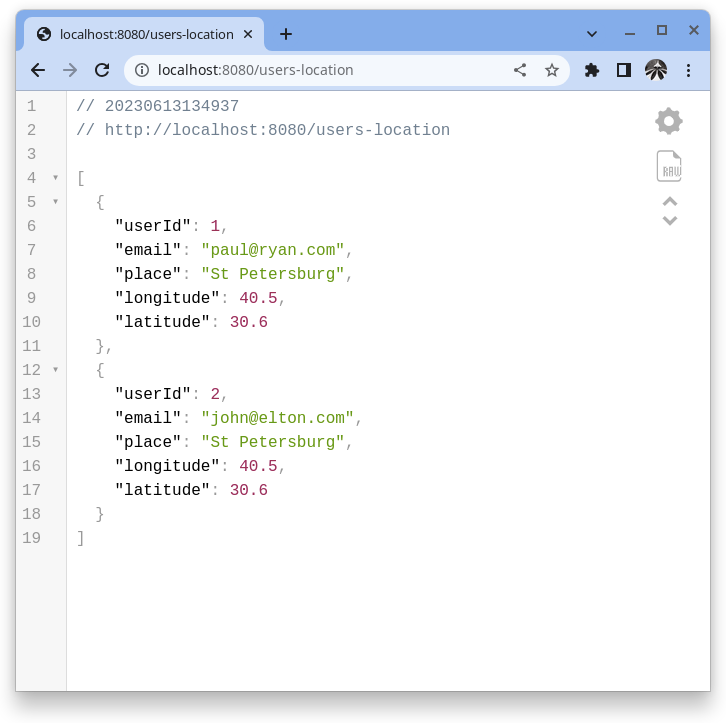
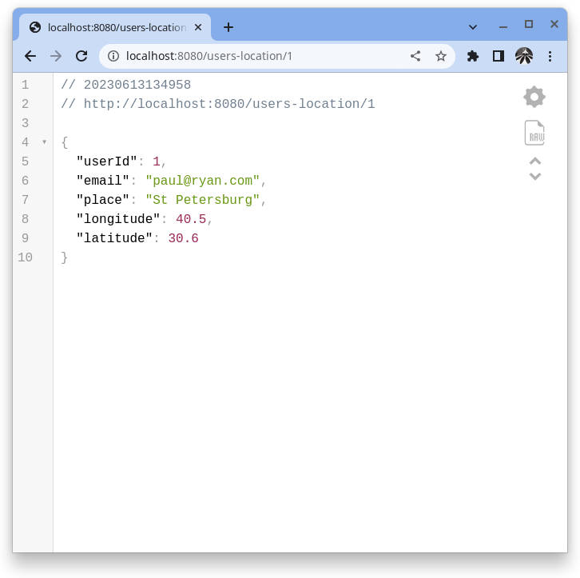

## UNDERSTANDING DTOs
### What are DTOs
Data Transfer Objects (DTOs) in Java are objects that 
transport data between subsystems. It is an enterprise 
design pattern to aggregate data. The main purpose is to 
reduce the number of system calls needed between the 
subsystems, reducing the amount of overhead created.

Definition from [here](https://snyk.io/blog/how-to-use-java-dtos/)

### Entity to DTO Conversion
Data Transfer Object Design Pattern is a frequently used 
design pattern. It is basically used to pass data with 
multiple attributes in one shot from the client to the
server, to avoid multiple call to a remote server.

Another advantage of using DTOs on RESTful APIS is that 
they can help hide implementation details of domain objects
(JPA Entities). Exposing entities through endpoints can 
become a security issue if we do not carefully handle what 
properties can be changed through what operations.

In this brief tutorial we will learn how to create a DTO 
class and how to Convert Entities to DTO and vice versa.
### Models
The project has two models, User and Location
#### User Class
```java
package dev.paul.springboot.model;

@Data
@NoArgsConstructor
@AllArgsConstructor
@Entity
@Table(name = "users")
public class User {
    @Id
    @GeneratedValue(strategy = GenerationType.IDENTITY)
    private Long id;

    private String email;

    @Column(name = "first_name")
    private String firstName;

    @Column(name = "last_name")
    private String lastName;

    private String password;

    @ManyToOne(fetch = FetchType.EAGER, optional = false)
    @JoinColumn(name = "location_id")
    private Location location;
}
```
#### Location class
```java
package dev.paul.springboot.model;

@Data
@NoArgsConstructor
@AllArgsConstructor
@Entity
@Table(name = "locations")
public class Location {
    @Id
    @GeneratedValue(strategy = GenerationType.IDENTITY)
    private Long id;
    private String place;
    private String description;
    private Double longitude;
    private Double latitude;
}
```
### Data Transfer Object
We do not want to expose everything about a User entity 
to the client. Neither do we want the same for the Location
entity. We need to expose specific information to the client
about User and Location. We create a DTO that puts together 
the information we want the client to access.
#### DTO Class
The DTO is a Plain Old Java Object (POJO).

The client should only see userId, email (from User Entity),
place, longitude, latitude (from Location Entity). 

We use this DTO in the service class to ensure that the 
controller interacts with the DTO and not the entities. 
Only the DAOs (repositories) should be interacting with 
the Entities directly.
```java
package dev.paul.springboot.dto;

@Data
public class UserLocationDTO {
    private Long userId;
    private String email;
    private String place;
    private Double longitude;
    private Double latitude;
}
```
### Repositories
We have repositories for both User and Location
#### UserRepository
```java
package dev.paul.springboot.repository;

public interface UserRepository extends JpaRepository<User, Long> {
}
```
#### LocationRepository
```java
package dev.paul.springboot.repository;

public interface LocationRepository extends JpaRepository<Location, Long> {
}
```
### The Mapper
Let's now explore the mapper that performs the conversion of
an entity to a DTO. We use a dedicated mapper that we create
ourselves to perform the mappings. Currently, we have not
provided a method in the mapper to convert dto to entity.
#### Mapper class
```java
package dev.paul.springboot.mapper;

@Component
public class Mapper {

    public UserLocationDTO convertEntityToDto(User user) {
        UserLocationDTO userLocationDTO = new UserLocationDTO();
        userLocationDTO.setUserId(user.getId());
        userLocationDTO.setEmail(user.getEmail());
        userLocationDTO.setPlace(user.getLocation().getPlace());
        userLocationDTO.setLongitude(user.getLocation().getLongitude());
        userLocationDTO.setLatitude(user.getLocation().getLatitude());

        return userLocationDTO;
    }
}
```
### Service 
The service class uses a dedicated Mapper class that we 
introduce above to perform entity to DTO and vice versa 
conversions. 
#### Service class
```java
package dev.paul.springboot.service;

@Service
public class UserService {

    private final UserRepository userRepository;
    private final Mapper mapper;

    public UserService(UserRepository userRepository, Mapper mapper) {
        this.userRepository = userRepository;
        this.mapper = mapper;
    }

    public List<UserLocationDTO> getAllUsersLocation(){
        return userRepository.findAll()
                .stream()
                //.map(this::convertEntityToDto)
                .map(mapper::convertEntityToDto)
                .collect(Collectors.toList());
    }

    public UserLocationDTO getUserById(Long id) {
        User user = userRepository.findById(id).orElseThrow();
        return mapper.convertEntityToDto(user);
    }
}
```
### The Controller
The controller class utilizes the Service class which interacts
with DTOs instead of the Entities directly, thereby utilizing 
the benefits of DTOs:
* Avoid multiple calls to remote server
* Hide implementation details of JPA Entities.
#### Controller class
```java
package dev.paul.springboot.controller;

@RestController
@RequestMapping("/users-location")
public class UserController {

    private final UserService userService;

    public UserController(UserService userService) {
        this.userService = userService;
    }

    @GetMapping
    public List<UserLocationDTO> getAllUsersLocation() {
        return userService.getAllUsersLocation();
    }

    @GetMapping("/{userId}")
    public UserLocationDTO getUserLocationByUserId(@PathVariable("userId") Long userId) {
        return userService.getUserById(userId);
    }
}
```
### Initializing some test data
In the application's main method, we implement CommandLineRunner
and use it to create some entities to test our application's 
logic.
#### Implementing Test Data from Main Class

```java
package dev.paul.springboot;

@SpringBootApplication
public class SpringbootDtoMain implements CommandLineRunner {

    public static void main(String[] args) {
        SpringApplication.run(SpringbootDtoTutorialApplication.class, args);
    }

    private final UserRepository userRepository;
    private final LocationRepository locationRepository;

    public SpringbootDtoMain(UserRepository userRepository,
                             LocationRepository locationRepository) {
        this.userRepository = userRepository;
        this.locationRepository = locationRepository;
    }

    @Override
    public void run(String... args) throws Exception {

        Location location = new Location();
        location.setPlace("St Petersburg");
        location.setDescription("St Petersburg is  a great place to live");
        location.setLongitude(40.5);
        location.setLatitude(30.6);
        locationRepository.save(location);

        User user1 = new User();
        user1.setFirstName("Paul");
        user1.setLastName("Ryan");
        user1.setEmail("paul@ryan.com");
        user1.setPassword("secret");
        user1.setLocation(location);
        userRepository.save(user1);

        User user2 = new User();
        user2.setFirstName("Elton");
        user2.setLastName("John");
        user2.setEmail("john@elton.com");
        user2.setPassword("s3cr3t");
        user2.setLocation(location);
        userRepository.save(user2);
    }
}
```
Run the app and access your endpoints. You can use a browser 
or Postman or any other client of your choice to access the 
endpoints.
* localhost:8080/users-location
  
* localhost:8080/users-location/1
  
* localhost:8080/users-location/2
  

### A bulk of this project is pulled from [here](https://www.youtube.com/watch?v=THv-TI1ZNMk). All Credits and Rights reserved for their respective owner(s).


